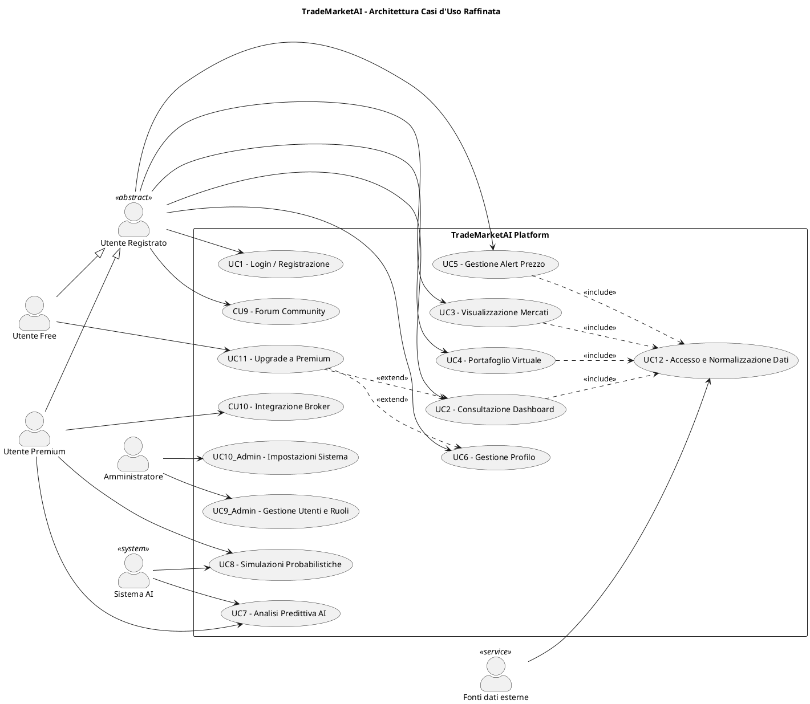
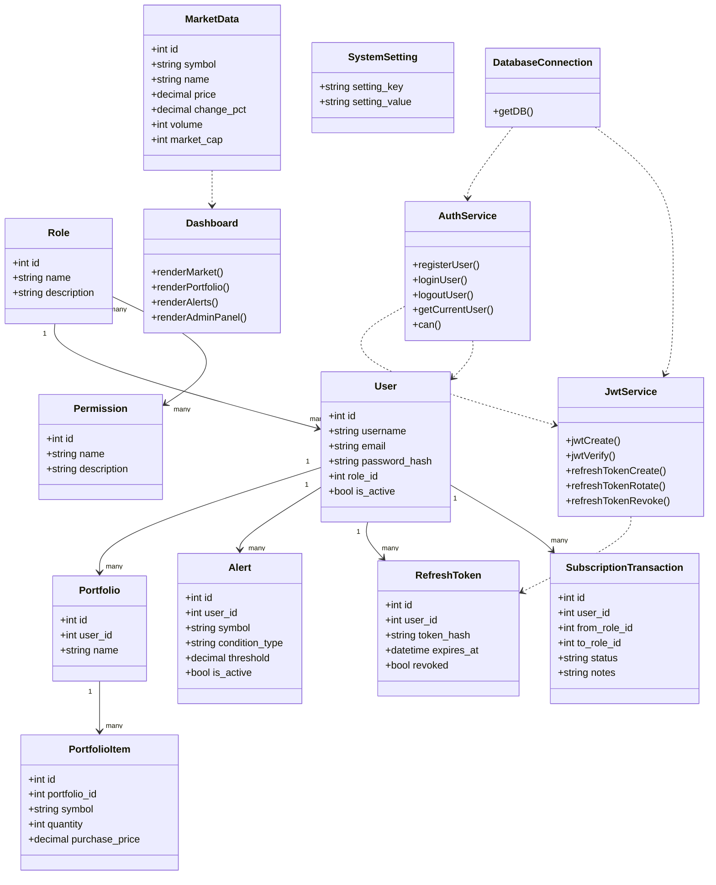

# Diagrammi del progetto

## Diagramma dei casi d'uso

## Scenario dettagliato

### CU-Upgrade: passaggio da Free a Premium

**Attore principale:** Utente Free

**Precondizioni:**
- l'utente ha effettuato il login;
- il profilo è attivo;
- il parametro `transactions_enabled` nel database è abilitato.

**Flusso principale:**
1. L'utente apre la dashboard.
2. Il sistema mostra il pulsante di upgrade solo agli account Free.
3. L'utente conferma il cambio piano.
4. Il sistema esegue una transazione sul database.
5. Il sistema verifica che le transazioni siano abilitate.
6. Il sistema controlla che l'utente sia ancora Free.
7. Il sistema registra la transazione in `subscription_transactions`.
8. Il sistema aggiorna il ruolo dell'utente a Premium.
9. Il sistema conferma l'avvenuto upgrade.

**Postcondizioni:**
- il ruolo dell'utente diventa Premium;
- le funzionalità Premium diventano disponibili nella dashboard.

**Eccezioni:**
- se `transactions_enabled` è disattivato, il sistema interrompe l'operazione e mostra l'errore di transazioni disattivate;
- se l'utente non è più Free, l'operazione viene rifiutata;
- se manca la configurazione necessaria nel database, il sistema segnala un errore di configurazione.

## Diagramma delle classi

> Nota: il progetto è implementato in stile procedurale PHP, quindi questo diagramma rappresenta il modello logico del dominio e i moduli di servizio corrispondenti.

